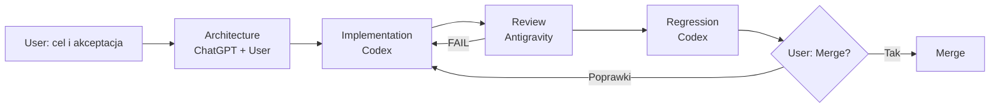

# 01. Przepływ pracy z AI

> Zasady kontrolowanej współpracy Usera, ChatGPT, Codex i Antigravity przy rozwoju Athlete Platform.

## Spis treści

- [Cel](#cel)
- [Role i odpowiedzialności](#role-i-odpowiedzialności)
- [Workflow](#workflow)
- [Przekazanie między rolami](#przekazanie-między-rolami)
- [Zasady wspólne](#zasady-wspólne)
- [Artefakty](#artefakty)
- [Obsługa niepewności](#obsługa-niepewności)
- [Powiązane dokumenty](#powiązane-dokumenty)

## Cel

AI wspiera analizę, implementację i review, ale nie zastępuje odpowiedzialności właściciela projektu. Każda zmiana przechodzi od jawnego celu architektonicznego, przez implementację i niezależny review, do pełnej regresji i świadomego merge.

## Role i odpowiedzialności

### User

User jest właścicielem celu, zakresu i ostatecznej decyzji.

- określa problem, ograniczenia i oczekiwany rezultat;
- akceptuje decyzje architektoniczne oraz zmiany publicznych kontraktów;
- rozstrzyga niejednoznaczności, których nie można ustalić z repozytorium;
- zatwierdza działania destrukcyjne, zewnętrzne i rozszerzające zakres;
- podejmuje decyzję o merge.

### ChatGPT

ChatGPT pełni rolę partnera analitycznego i architektonicznego.

- pomaga doprecyzować problem i odpowiedzialności;
- przygotowuje warianty, ADR-y, kryteria akceptacji i plan migracji;
- sprawdza spójność pojęć i dokumentacji;
- nie przedstawia hipotezy jako stanu implementacji;
- przekazuje Codexowi zakres możliwy do zweryfikowania w kodzie.

### Codex

Codex odpowiada za pracę w repozytorium.

- czyta kod, testy, handbook i powiązane ADR-y;
- sprawdza stan worktree oraz chroni niezwiązane zmiany;
- implementuje najmniejszą spójną zmianę;
- dodaje lub aktualizuje testy;
- uruchamia weryfikację, przegląda diff i raportuje faktyczne wyniki;
- nie tworzy commita, jeśli User o niego nie poprosił;
- nie rozszerza architektury poza zaakceptowany zakres.

### Antigravity

Antigravity pełni rolę niezależnego reviewera.

- ocenia diff względem [architektury](02-architecture.md), [ADR-ów](03-architecture-decisions.md) i [checklisty](06-review-checklist.md);
- szuka regresji, bypassów, ukrytego I/O, niedeterminizmu i zmian API;
- weryfikuje dowody testowe;
- raportuje findings według wpływu i wydaje standardowy werdykt;
- nie zmienia kryteriów akceptacji po fakcie.

## Workflow

### Architecture

1. Ustal źródło prawdy, właściciela decyzji i granice warstw.
2. Oddziel stan obecny od planowanego.
3. Dla istotnej decyzji przygotuj lub zaktualizuj ADR.
4. Zdefiniuj kryteria testowe oraz elementy poza zakresem.

### Implementation

1. Codex odczytuje właściwe dokumenty i call sites.
2. Sprawdza dirty worktree przed edycją.
3. Implementuje bez zmiany niezwiązanej logiki.
4. Dodaje testy na właściwym poziomie piramidy.
5. Przekazuje raport: pliki, kontrakty, testy, diff i ryzyka.

### Review

1. Antigravity przegląda kod niezależnie od opisu implementatora.
2. Każdy finding wskazuje konkretny dowód i wpływ.
3. Reviewer używa werdyktu `PASS`, `PASS WITH MINOR FIX` albo `FAIL`.
4. Blockery wracają do implementacji.

### Regression

1. Codex odtwarza findings.
2. Poprawia wyłącznie potwierdzony błąd.
3. Dodaje test regresyjny, jeżeli brakowało ochrony.
4. Uruchamia testy modułu, pełny pytest przy zmianie przekrojowej, compileall i diff check.

### Merge

Merge następuje po akceptacji Usera, czystej wymaganej weryfikacji i rozwiązaniu blockerów. Agent nie interpretuje braku odpowiedzi jako zgody na merge.

## Przekazanie między rolami

Każde przekazanie powinno zawierać:

- cel i jawny zakres;
- elementy poza zakresem;
- powiązane ADR-y i dokumenty;
- publiczne kontrakty, których nie wolno zmienić;
- kryteria akceptacji;
- zmienione pliki lub commit/diff do review;
- uruchomione testy z wynikiem;
- znane ryzyka i TODO.

Reviewer nie powinien polegać wyłącznie na podsumowaniu poprzedniego agenta — repozytorium i testy są dowodem.

## Zasady wspólne

- Najpierw sprawdź kod, potem formułuj wniosek.
- Nie wymyślaj modułów, pól, reguł ani statusu wdrożenia.
- Informację niepotwierdzoną oznacz jako TODO lub pytanie do Usera.
- Nie wykonuj destrukcyjnych operacji bez jawnej zgody.
- Nie modyfikuj niezwiązanych zmian w worktree.
- Nie używaj AI lub LLM jako źródła faktów domenowych ani decyzji treningowej.
- Zachowuj poufność danych sportowca i nie wysyłaj ich do usług zewnętrznych bez autoryzacji.
- Każdy raport ma odróżniać test uruchomiony od testu jedynie rekomendowanego.

## Artefakty

| Etap | Minimalny artefakt |
|---|---|
| Architecture | specyfikacja, diagram lub ADR |
| Implementation | diff, testy i raport wykonania |
| Review | findings, dowody i werdykt |
| Regression | test reprodukujący oraz wynik ponownej weryfikacji |
| Merge | zaakceptowany commit lub zestaw commitów |

Krótkie szablony startowe znajdują się w katalogu [prompts](prompts/).

## Obsługa niepewności

Jeżeli informacji nie można potwierdzić:

1. przeszukaj kod, testy, historię Git i istniejącą dokumentację;
2. wskaż, czego dokładnie brakuje;
3. oznacz punkt jako `TODO`, jeśli nie blokuje bezpiecznej pracy dokumentacyjnej;
4. poproś Usera o decyzję, jeżeli wybór zmieni publiczny kontrakt, architekturę lub dane;
5. nie przyjmuj rozwiązania tylko dlatego, że jest typowe w innym projekcie.

## Powiązane dokumenty

- Poprzedni: [Przegląd projektu](00-project-overview.md)
- Indeks: [Engineering Handbook](README.md)
- Następny: [Architektura](02-architecture.md)
- [Standardy kodowania](04-coding-standards.md)
- [Strategia testowania](05-testing-strategy.md)
- Prompty: [Codex](prompts/codex.md) · [Antigravity](prompts/antigravity.md) · [ChatGPT](prompts/chatgpt.md)
