# 02. Architektura Athlete Platform

> Referencja architektoniczna opisująca stan implementacji Athlete Platform, granice odpowiedzialności, kierunek zależności oraz kanoniczne przepływy danych.

## Spis treści

- [Status i zakres](#status-i-zakres)
- [Vision](#vision)
- [Architectural Principles](#architectural-principles)
- [Konteksty i moduły](#konteksty-i-moduły)
- [Layered Architecture](#layered-architecture)
  - [Domain Layer](#domain-layer)
  - [Application Layer](#application-layer)
  - [Infrastructure Layer](#infrastructure-layer)
  - [Presentation Layer](#presentation-layer)
- [Composition Root](#composition-root)
- [Dependency Injection](#dependency-injection)
- [Canonical Pipeline](#canonical-pipeline)
- [MorningCoach](#morningcoach)
- [Intelligence Workflow](#intelligence-workflow)
- [Recommendation Workflow](#recommendation-workflow)
- [Decision i Planner](#decision-i-planner)
- [Athlete Memory](#athlete-memory)
- [Health](#health)
- [Recovery](#recovery)
- [Performance](#performance)
- [Training i ukończenie treningu](#training-i-ukończenie-treningu)
- [Explainability i prezentacja](#explainability-i-prezentacja)
- [Niezmienniki architektoniczne](#niezmienniki-architektoniczne)
- [Stan przejściowy i dług techniczny](#stan-przejściowy-i-dług-techniczny)
- [Future modules](#future-modules)
- [Mapa kodu](#mapa-kodu)
- [Powiązane dokumenty](#powiązane-dokumenty)

## Status i zakres

Dokument opisuje architekturę obecną w repozytorium. Kod jest źródłem prawdy dla stanu implementacji, a zaakceptowane ADR-y definiują decyzje i ograniczenia długoterminowe.

Stosowane oznaczenia:

| Status | Znaczenie |
|---|---|
| **Implemented** | Element istnieje i uczestniczy w aktywnym przepływie. |
| **Compatibility** | Element nadal istnieje publicznie, ale nie należy do kanonicznej ścieżki. |
| **Planned / not implemented** | Kierunek opisany w ADR lub wynikający z obecnych granic; nie jest częścią działającego systemu. |

Athlete Platform jest modularnym monolitem. Warstwy są granicami logicznymi, a nie jednym, ścisłym podziałem katalogów. Część starszych modułów powstała przed przyjęciem aktualnego modelu warstwowego, dlatego dokument wskazuje jawnie odstępstwa i obszary przejściowe.

## Vision

Athlete Platform przekształca dane zdrowotne, historię wykonanych treningów i bieżący stan zawodnika w deterministyczną decyzję treningową, pozatreningowe rekomendacje, wykonalny plan treningu oraz czytelne wyjaśnienie.

Architektura ma zapewniać, że:

- decyzja treningowa ma jedno, kontrolowane źródło;
- fakty historyczne pozostają oddzielone od ich bieżącej interpretacji;
- analityka jest odtwarzalna dla tych samych danych wejściowych;
- logika domenowa nie zależy od bazy danych, interfejsu użytkownika ani zegara systemowego;
- workflow składa wyspecjalizowane komponenty, ale nie przejmuje ich logiki;
- prezentacja opisuje wynik, lecz go nie zmienia;
- nowe źródła danych i reguły można dodawać bez tworzenia globalnego silnika wiedzy.

## Architectural Principles

### 1. Jedno miejsce podejmowania decyzji treningowej

`DecisionEngine` jest jedynym komponentem odpowiedzialnym za wybór rodzaju treningu i jego obciążenia. Recommendation, Planner, Explainability i Presenter nie mogą korygować tej decyzji.

### 2. Fakty, projekcje i decyzje są różnymi pojęciami

- `AthleteMemoryEvent` jest zapisem faktu historycznego.
- `AthleteMemorySnapshot` jest odtwarzalną projekcją read-side.
- `AthleteObservation` i `AthleteInsight` są efemerycznymi, deterministycznymi interpretacjami danych.
- `DecisionResult` jest wynikiem polityki decyzyjnej.
- `RecommendationResult` rozszerza decyzję o działania poza samym treningiem.

Żaden z tych modeli nie zastępuje pozostałych.

### 3. Determinizm i jawne źródła czasu

Wynik czystego komponentu powinien zależeć wyłącznie od jawnych danych wejściowych. Pola `as_of` pochodzą z datowanych faktów, obserwacji lub kontekstu, a nie z `datetime.now()`.

### 4. Immutable by default

Modele przepływające przez kanoniczny pipeline są, tam gdzie to możliwe, niezmiennymi dataclasses oraz krotkami. Ogranicza to ukryte mutacje między etapami i ułatwia testowanie deterministyczności.

### 5. Evidence i provenance

Obserwacje, insighty i rekomendacje zachowują stabilne referencje do danych źródłowych oraz informację o regułach, które utworzyły wynik. Tekst prezentacyjny nie jest dowodem domenowym.

### 6. Jawna orkiestracja

Use case i workflow wywołują komponenty w określonej kolejności. Nie korzystają z service locatora, globalnego rejestru ani ukrytego kontenera DI.

### 7. I/O na granicach

Repozytoria, DuckDB, parsery plików i eksportery należą do granic infrastrukturalnych. Silniki domenowe oraz reguły nie powinny samodzielnie wykonywać I/O.

### 8. Oddzielenie decyzji, rekomendacji, planowania i prezentacji

| Odpowiedzialność | Właściciel |
|---|---|
| Wybór treningu i obciążenia | `DecisionEngine` |
| Działania wspierające poza treningiem | `RecommendationRule` |
| Normalizacja rekomendacji | `RecommendationBuilder` |
| Zbudowanie wykonalnego treningu | `PlannerEngine` |
| Wyjaśnienie decyzji i rekomendacji | `DecisionExplainabilityBuilder` |
| Format odpowiedzi MorningCoach | `MorningCoachPresenter` |

### 9. Kompatybilność nie definiuje kierunku rozwoju

Starsze publiczne klasy mogą pozostać dostępne w okresie migracji. Ich istnienie nie oznacza, że należą do aktywnego przepływu lub są wzorcem dla nowych modułów.

## Konteksty i moduły

Repozytorium grupuje kod wokół odpowiedzialności domenowych:

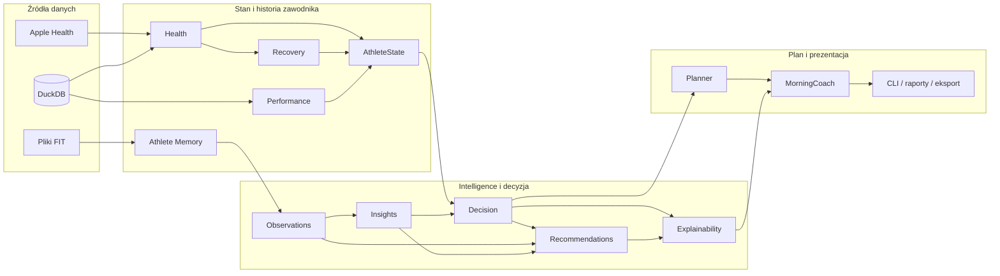

Diagram pokazuje odpowiedzialności, nie wszystkie bezpośrednie importy. Baza danych jest używana przez adaptery i starsze usługi dostępu do danych, a nie przez Recommendation lub Decision Engine.

## Layered Architecture

Docelowy kierunek zależności wygląda następująco:

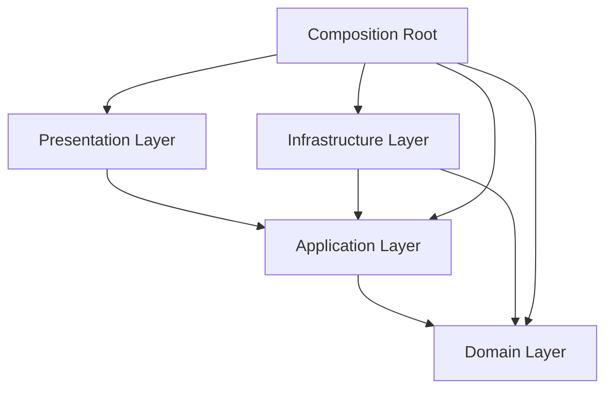

`Composition Root` jest kontrolowanym wyjątkiem: zna konkretne implementacje ze wszystkich warstw, ponieważ jego zadaniem jest złożenie grafu obiektów. Kod domenowy nie może zależeć zwrotnie od composition root.

### Domain Layer

Warstwa domenowa przechowuje język biznesowy, niezmienne modele, reguły i czyste obliczenia. W tym repozytorium nie jest ograniczona do katalogu `domain/`.

Najważniejsze elementy:

- `athlete/models.py` i `athlete/states/` — stan zawodnika oraz jego składowe;
- `athlete/intelligence/` — obserwacje, insighty, projector i reguły insightów;
- `athlete/memory/models.py`, `trends.py`, `patterns.py` — kontrakty snapshotu i czysta analityka pamięci;
- `athlete/review/` — typowany przegląd tygodniowy;
- `decision/diagnosis/`, `decision/prescription/`, `decision/selection/` — diagnoza, preskrypcja i wybór decyzji;
- `recommendation/models.py`, `rules.py`, `builder.py`, `engine.py` — modele i deterministyczny przepływ rekomendacji;
- `planner/` — wybór przepisu, DSL i kompilacja do `PlannedWorkout`;
- `health/`, `recovery/` i modele `performance/` — bieżący stan zdrowia, regeneracji i wydolności;
- `workout/`, `training/analysis/`, `execution/`, `feedback/` — modele i analiza wykonania treningu.

Warstwa domenowa nie powinna:

- otwierać połączeń z bazą;
- czytać repozytoriów;
- formatować tekstów UI;
- pobierać bieżącego czasu;
- tworzyć zależności aplikacyjnych.

### Application Layer

Warstwa aplikacyjna orkiestruje przypadki użycia i przekazuje typowane wyniki między komponentami. Nie duplikuje reguł domenowych.

Aktualne główne elementy:

- `MorningCoachUseCase` — kanoniczny dzienny use case;
- `IntelligenceDecisionWorkflow` — przepływ observations → insights → decision → recommendations → explainability;
- `WeeklyReviewWorkflow` — jednokrotny odczyt snapshotu i budowa przeglądu;
- `PostWorkoutRecordingService` — analiza ukończonego treningu i zapis eventu;
- builders oceny i kontekstu wiedzy: `AthleteKnowledgeContextBuilder`, `TrainingAssessmentBuilder`, `AthleteAssessmentBuilder`;
- `AdaptationPolicy` — wyznaczenie jawnej dyrektywy adaptacyjnej;
- `DecisionExplainabilityBuilder` — budowa strukturalnego wyniku wyjaśnialności;
- `application/composition.py` — bootstrap i composition root.

Application Layer może znać porty wymagane przez use case, ale nie powinna wiązać logiki biznesowej z konkretnym DuckDB lub parserem pliku.

### Infrastructure Layer

Warstwa infrastruktury realizuje zapis, odczyt i integrację ze światem zewnętrznym:

- `core/database.py` i schematy DuckDB;
- `repositories/` oraz `training/repository.py`;
- `athlete/memory/repository.py`;
- `collectors/apple_health/`;
- parser FIT i source identity w `training/parsers/` oraz `training/ingestion/`;
- adaptery plikowe i eksportery treningów;
- skrypty importujące i inicjalizujące dane.

Modele zwracane przez adaptery powinny być stabilnymi wejściami dla warstwy aplikacyjnej. Szczegóły tabel, plików i klientów zewnętrznych nie powinny przenikać do reguł domenowych.

### Presentation Layer

Warstwa prezentacji odpowiada za strukturę odpowiedzi dla użytkownika i jej renderowanie:

- `MorningCoachPresenter` i `MorningCoachReport`;
- `briefing/`, `renderers/` i część eksporterów;
- entry pointy CLI w `scripts/`, w tym `scripts/morning_coach.py`.

Presenter może mapować typowane wyniki na komunikaty, lecz nie może uruchamiać silników decyzyjnych ani zmieniać decyzji. W obecnym układzie `DecisionExplainabilityBuilder` znajduje się w `application/`; stanowi granicę application/presentation, ponieważ przekształca strukturalne powody i rekomendacje w gotowy wynik wyjaśnialności.

## Composition Root

Kanonicznym composition root jest `application/composition.py`. Zawiera jawne, małe funkcje budujące graf zależności:

| Factory | Budowany obiekt |
|---|---|
| `build_decision_engine()` | `DecisionEngine` |
| `build_planner_engine()` | `PlannerEngine` |
| `build_recommendation_engine()` | pięć reguł, `RecommendationBuilder` i `RecommendationEngine` |
| `build_intelligence_decision_workflow()` | kompletny workflow Intelligence |
| `build_weekly_review_workflow(database)` | reader Memory, analityka i review service |
| `build_morning_coach_use_case(database, health_repository=None)` | pełny graf MorningCoach |

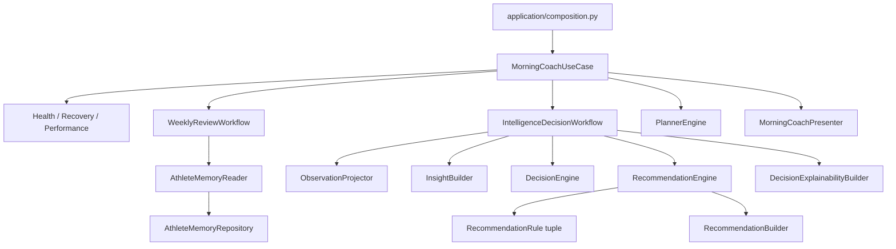

Entry point `scripts/morning_coach.py` tworzy `Database`, przekazuje ją do `build_morning_coach_use_case()` i uruchamia gotowy use case. Skrypt nie konfiguruje samodzielnie silników.

`_DeferredHealthHistoryReader` opóźnia utworzenie domyślnego `HealthRepository` do pierwszego odczytu. Pozwala zbudować graf bez wykonania zapytania do bazy i zachowuje możliwość wstrzyknięcia testowego `HealthHistoryReader`.

## Dependency Injection

Projekt stosuje constructor injection bez frameworka DI:

- use case otrzymuje gotowe workflow, silniki, builders i presenter;
- `IntelligenceDecisionWorkflow` otrzymuje projector, insight builder, Decision Engine, Recommendation Engine i explainability builder;
- `RecommendationEngine` otrzymuje immutable tuple reguł oraz builder;
- `WeeklyReviewWorkflow` otrzymuje reader, silniki analityczne i review service;
- adaptery infrastrukturalne otrzymują połączenie lub `Database` w composition root.

Zasady:

1. Nowe zależności produkcyjne składa composition root.
2. Testy mogą przekazywać fakes lub spies przez ten sam konstruktor.
3. Workflow nie tworzy reguł ani repozytoriów wewnątrz metody wykonawczej.
4. Nie wprowadza się singletonów, globalnych rejestrów ani service locatorów.
5. Opcjonalne konstruktory domyślne istnieją obecnie w części klas dla kompatybilności; aktywny bootstrap używa jawnego wstrzykiwania.

## Canonical Pipeline

Kanoniczny pipeline decyzyjny jest realizowany przez `IntelligenceDecisionWorkflow`:

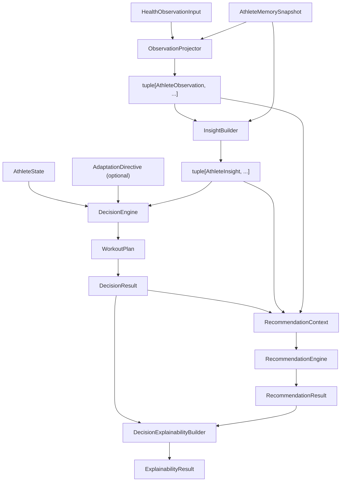

Wynikiem workflow jest immutable `IntelligenceDecisionResult`, który zawiera:

- observations;
- insights;
- `WorkoutPlan`;
- wyodrębniony `DecisionResult`;
- `RecommendationResult`;
- `ExplainabilityResult`.

Każdy etap otrzymuje gotowy wynik poprzedniego etapu. Workflow nie implementuje reguł obserwacji, insightów, decyzji ani rekomendacji.

## MorningCoach

`MorningCoachUseCase` jest kanonicznym dziennym koordynatorem aplikacji. Przygotowuje wejścia, wykonuje Intelligence Workflow dokładnie raz, przekazuje decyzję do Plannera i oddaje gotowe wyniki Presenterowi.

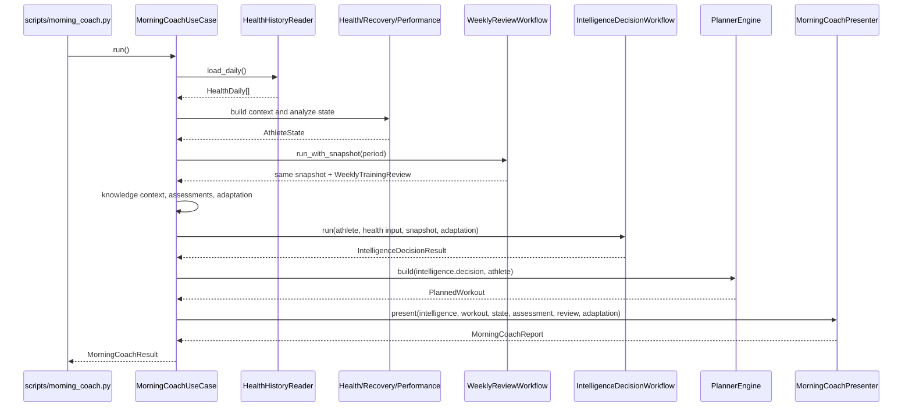

Istotne granice:

- ten sam `AthleteMemorySnapshot` zasila review oraz Intelligence Workflow;
- `HealthObservationInput` otrzymuje deterministyczne `observed_at` i evidence z daty danych zdrowotnych;
- Planner otrzymuje `DecisionResult`, a nie `RecommendationResult`;
- Presenter otrzymuje gotowe wyniki i nie uruchamia Decision ani Recommendation Engine;
- `MorningCoachResult.decision` przechowuje `WorkoutPlan`, natomiast pełny wynik Intelligence pozostaje wejściem Presentera.

`MorningCoachBuilder` i `ExplanationBuilder` pozostają dostępne jako API kompatybilnościowe. Nie uczestniczą w aktywnej ścieżce `MorningCoachUseCase`.

## Intelligence Workflow

Athlete Intelligence jest deterministyczną warstwą między surowym kontekstem a decyzją:

1. `ObservationProjector` buduje `AthleteObservation` z bieżącego health input oraz snapshotu Memory.
2. `InsightBuilder` buduje `AthleteInsight` z obserwacji i workout observations.
3. `DecisionEngine` otrzymuje gotowe insighty razem z `AthleteState` i opcjonalną adaptacją.
4. Recommendation Engine otrzymuje decyzję, insighty i obserwacje.
5. Explainability łączy strukturalne powody decyzji z rekomendacjami.

Observations i insights:

- nie są zapisywane jako trwała wiedza;
- nie są eventami Athlete Memory;
- nie zawierają tekstów UI;
- zachowują confidence, evidence i czas wynikający ze źródeł;
- mogą zostać przeliczone z tych samych wejść.

Istniejący `AthleteKnowledgeContext` jest typowanym obiektem aplikacyjnym składanym na potrzeby ocen MorningCoach. Nie jest implementacją Knowledge Engine ani trwałego Knowledge Store.

## Recommendation Workflow

Recommendation Engine odpowiada na pytanie: „co zawodnik powinien zrobić poza samym treningiem?”. Nie podejmuje decyzji treningowej i nie zmienia wyniku Decision Engine.

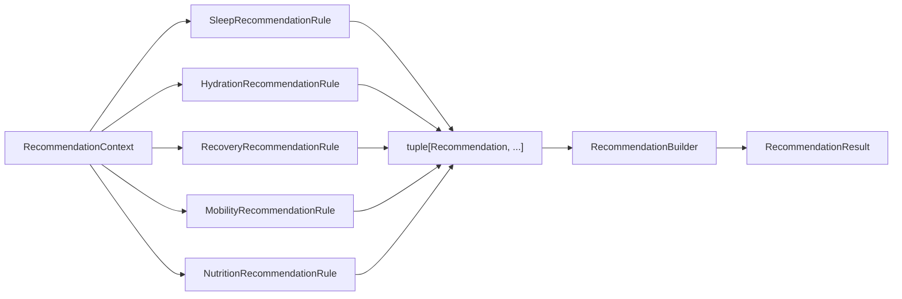

### Kontrakty

- `RecommendationContext` zawiera `DecisionResult`, insights, observations, opcjonalne `NutritionAssessment` oraz opcjonalne, deterministyczne `as_of`.
- `RecommendationRule.evaluate()` zwraca od zera do wielu immutable `Recommendation`.
- reguła jest bezstanowa, deterministyczna i nie zna innych reguł;
- `RecommendationEngine` wywołuje każdą wstrzykniętą regułę raz, spłaszcza kandydatów i przekazuje ich do buildera;
- `RecommendationBuilder` nie analizuje contextu i nie aktywuje rekomendacji.

### Aktualne reguły

Composition root rejestruje jawnie:

- `SleepRecommendationRule`;
- `HydrationRecommendationRule`;
- `RecoveryRecommendationRule`;
- `MobilityRecommendationRule`;
- `NutritionRecommendationRule` — mapuje dostępne cele carbohydrates i hydration z opcjonalnego `NutritionAssessment` na istniejące typy rekomendacji.

Reguła Nutrition zwraca pusty wynik, gdy context nie zawiera assessmentu. Bieżący `IntelligenceDecisionWorkflow` nie przekazuje jeszcze tego pola.

`NutritionRecommendationRule` aktywuje zwiększenie podaży węglowodanów wyłącznie przy dostępnym celu. Enum `RecommendationType` zawiera również ograniczenie dodatkowej aktywności, dla którego obecnie nie istnieje reguła aktywująca.

### Normalizacja

Builder:

- deduplikuje kandydatów według `Recommendation.type`;
- zachowuje najwyższy priorytet i najwyższe confidence;
- łączy unikalne evidence i source rules w stabilnej kolejności;
- zachowuje najpóźniejsze `as_of`;
- generuje stabilne ID oparte na SHA-256;
- sortuje po priorytecie `HIGH`, `MEDIUM`, `LOW`, następnie według stabilnej kolejności typu i ID.

Dzięki temu wynik jest niezależny od kolejności reguł i kandydatów.

## Decision i Planner

### DecisionEngine

`DecisionEngine` koordynuje wewnętrzny `DecisionPipeline` oraz `decision.selection.SelectionEngine`:

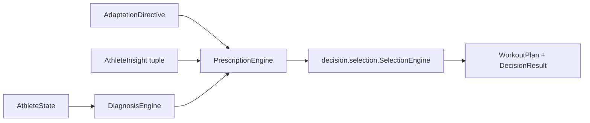

Diagnosis interpretuje stan zawodnika, Prescription wyznacza cel i ograniczenia, a Selection wybiera wynikowy plan. Strukturalne `DecisionReason` są później używane przez explainability i reguły, bez parsowania tekstów prezentacyjnych.

### PlannerEngine

Planner jest etapem wykonawczym po decyzji:

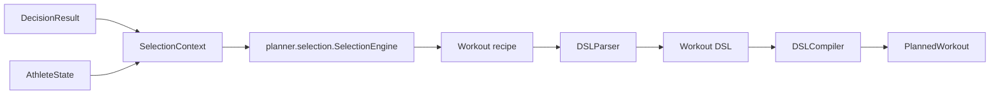

Planner wybiera przepis zgodny z już podjętą decyzją i kompiluje go do bloków treningowych. Nie wybiera celu treningowego, nie zmienia `DecisionResult` i nie analizuje rekomendacji pozatreningowych.

W repozytorium istnieją dwa komponenty o nazwie `SelectionEngine`: jeden w `decision/`, drugi w `planner/`. Mają różne odpowiedzialności i nie są zamienne.

## Athlete Memory

Athlete Memory jest append-only pamięcią wybranych zdarzeń zawodnika, obecnie ukończonych treningów. Nie jest pełnym Event Sourcingiem aplikacji i nie zastępuje operacyjnych repozytoriów Health ani Training.

### Write side

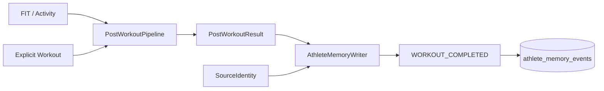

`PostWorkoutRecordingService` łączy analizę wykonanego treningu z zapisem eventu. Każdy `WORKOUT_COMPLETED` dotyczy jednej aktywności i jednego jawnego planu. Event przechowuje source identity, wersję schematu i payload; historyczny event nie jest nadpisywany.

### Read side

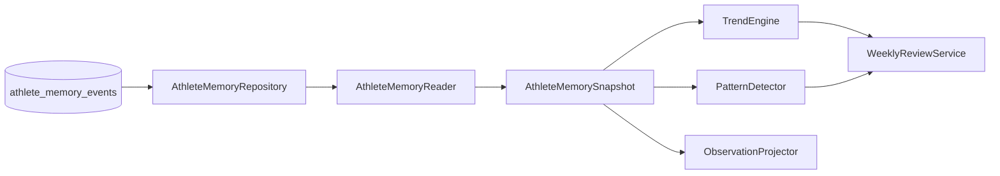

`AthleteMemoryReader` odczytuje zakres `[start, end)`, waliduje typ i wersję eventu, a następnie buduje typowane workout observations. Snapshot jest projekcją i może ewoluować; źródłem prawdy pozostaje historia eventów.

`WeeklyReviewWorkflow.run_with_snapshot()` zwraca dokładnie snapshot użyty do zbudowania review. MorningCoach może dzięki temu wykorzystać ten sam odczyt w Intelligence Workflow bez ponownego zapytania do Memory.

## Health

Obecny przepływ Health rozpoczyna się od `HealthDaily` odczytanych przez `HealthHistoryReader`. `ContextBuilder` buduje `HealthContext`, w tym bieżące wartości i trendy HRV, resting heart rate oraz snu. `HealthEngine` mapuje kontekst do `HealthState`.

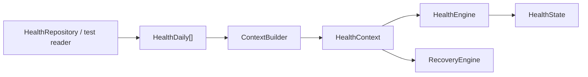

`HealthRepository` i collectory Apple Health są elementami infrastruktury. `HealthObservationInput` jest węższym, typowanym wejściem do Athlete Intelligence; nie przekazuje repozytorium ani całego kontekstu infrastrukturalnego.

Nie wszystkie pola `HealthState` są obecnie obsługiwane. Kod ustawia m.in. weight i steps jako brak danych; dokument nie traktuje ich jako zaimplementowanej analityki.

## Recovery

`RecoveryEngine` analizuje `HealthContext` i buduje `RecoveryResult` na podstawie:

- zmiany HRV względem baseline;
- zmiany resting heart rate;
- długości snu.

Wynik zawiera score, status, reasons oraz składowe metryki. Jest następnie częścią `AthleteState` i pośrednio wpływa na decyzję oraz Planner.

Należy odróżnić dwa pojęcia:

- `RecoveryEngine` oblicza bieżący stan regeneracji;
- `RecoveryRecommendationRule` może zaproponować `APPLY_RECOVERY_PROTOCOL` na podstawie gotowego contextu rekomendacji.

Reguła rekomendacji nie uruchamia ponownie analizy Recovery i nie czyta danych zdrowotnych z repozytorium.

## Performance

`PerformanceEngine` buduje `PerformanceState` z historii treningów:

- okres 7 dni reprezentuje krótkoterminowe obciążenie (`ATL`);
- okres 42 dni reprezentuje długoterminowe obciążenie (`CTL`);
- `TSB` jest różnicą `CTL - ATL`;
- fatigue, fitness i freshness są mapowane na te wartości.

Obecna implementacja tworzy wewnętrznie `WorkoutHistoryBuilder`, który korzysta z istniejącej historii treningów. Jest to znane sprzężenie starszej części architektury: `PerformanceEngine` nie otrzymuje jeszcze gotowego snapshotu ani portu przez konstruktor. Nowe moduły analityczne nie powinny kopiować tego wzorca; preferowany kontrakt to jawne dane wejściowe i czyste obliczenie.

## Training i ukończenie treningu

Kontekst Training obejmuje kilka odrębnych odpowiedzialności:

- ingestion — parser FIT, `ParsedActivity`, `ActivityFactory` i `SourceIdentity`;
- calculations — normalized power, intensity factor, TSS i strefy mocy;
- analysis — `WorkoutAnalyzer` i `WorkoutSummary`;
- planning — modele `Workout`, recipe, DSL i `PlannedWorkout`;
- execution — porównanie jawnego planu z aktywnością;
- feedback — deterministyczna informacja o wykonaniu;
- recording — zapis `WORKOUT_COMPLETED` przez `PostWorkoutRecordingService`.

Kanoniczna ścieżka ukończenia treningu:

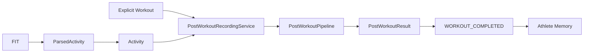

System nie odgaduje planu na podstawie wykonanej aktywności. Plan musi być wskazany jawnie. Athlete Memory nie przechowuje pełnego szeregu telemetrii FIT, dlatego pełny replay analizy blokowej nie jest obecnie gwarantowany bez zachowania źródła.

## Explainability i prezentacja

`DecisionExplainabilityBuilder` otrzymuje:

- strukturalne `DecisionReason` z `DecisionResult`;
- gotowy `RecommendationResult`.

Buduje `ExplainabilityResult`, ale nie podejmuje decyzji, nie uruchamia reguł i nie modyfikuje rekomendacji. `MorningCoachPresenter` adaptuje ten wynik do kompatybilnego `ExplanationReport` oraz tworzy finalny `MorningCoachReport`.

Ta kolejność jest istotna: explainability następuje po Recommendation Engine, dzięki czemu może wyjaśnić zarówno decyzję treningową, jak i działania wspierające, bez mieszania ich odpowiedzialności.

## Niezmienniki architektoniczne

Poniższe reguły obowiązują przy rozwoju systemu:

1. `DecisionEngine` pozostaje jedynym źródłem decyzji treningowej.
2. `RecommendationEngine` wyłącznie uruchamia reguły i deleguje normalizację.
3. Logika aktywacji rekomendacji znajduje się wyłącznie w `RecommendationRule`.
4. `RecommendationBuilder` nie analizuje `RecommendationContext`.
5. `PlannerEngine` konsumuje `DecisionResult`, nie `RecommendationResult`.
6. Workflow nie odczytuje repozytorium w imieniu silnika domenowego.
7. Presenter i renderer nie zmieniają wyniku domenowego.
8. Athlete Memory jest historią eventów; snapshot, observations i insights są projekcjami.
9. Nowa analityka powinna przyjmować typed snapshot i zwracać typed report bez I/O.
10. Czas i evidence muszą pochodzić z danych wejściowych.
11. Identyfikatory wymagające odtwarzalności nie mogą używać losowego `hash()` procesu.
12. Composition root jest jedynym miejscem konfiguracji pełnego grafu produkcyjnego.

## Stan przejściowy i dług techniczny

Architektura jest rozwijana przyrostowo. Aktualne odstępstwa, których nie należy ukrywać:

- część klas posiada opcjonalne zależności tworzone domyślnie dla kompatybilności, mimo że composition root wstrzykuje je jawnie;
- `PerformanceEngine` tworzy `WorkoutHistoryBuilder` wewnętrznie i pozostaje sprzężony ze starszą ścieżką danych;
- warstwy są rozproszone między katalogami historycznymi i nowymi bounded contexts;
- w repozytorium istnieją równoległe lub starsze nazwy, m.in. `planning/` obok `planner/` oraz dwa `SelectionEngine`;
- `MorningCoachBuilder`, `ExplanationBuilder`, starsze briefing/coach paths i część skryptów pozostają poza kanonicznym MorningCoach;
- tekstowe pola w historycznych eventach mogą istnieć dla kompatybilności, ale nie są źródłem prawdy dla Intelligence.

Zmiana tych obszarów wymaga osobnej migracji lub ADR, jeżeli wpływa na publiczny kontrakt. Nie należy wykonywać „porządkowania” przez niejawne przełączenie aktywnego pipeline'u.

## Future modules

Poniższa tabela rozróżnia pojęcia pojawiające się w decyzjach architektonicznych od działającego kodu:

| Obszar | Status | Granica architektoniczna |
|---|---|---|
| Knowledge Engine | **Planned / not implemented** | ADR-003 wyłącza go z obecnego zakresu. `AthleteKnowledgeContext` nie jest Knowledge Engine. |
| Athlete Knowledge Store | **Planned / not implemented** | Nie istnieje trwały magazyn insightów ani wiedzy. Athlete Memory nie pełni tej roli. |
| Learning Engine | **Planned / not implemented** | ADR-002 oddziela przyszłe uczenie od historii `WORKOUT_COMPLETED`. |
| Recommendation Rule Registry | **Not implemented** | Reguły są obecnie konfigurowane jawną tuple w composition root. |
| Dodatkowe recommendation rules | **Not implemented** | Enum zawiera typy carbohydrate intake i limit activity, ale brak odpowiadających reguł. |
| Persistowanie rekomendacji | **Not implemented** | `RecommendationResult` jest wynikiem bieżącego workflow, nie trwałym rekordem. |
| Generatywne AI jako decydent | **Not part of architecture** | LLM nie jest źródłem prawdy i nie zastępuje Decision Engine ani reguł domenowych. |

Każdy przyszły moduł musi otrzymać jawny kontrakt, właściciela danych i miejsce w kierunku zależności przed implementacją. Samo występowanie nazwy w dokumentacji nie oznacza zgody na utworzenie cross-cutting „god object”.

## Mapa kodu

| Obszar | Główne lokalizacje | Rola |
|---|---|---|
| Composition | `application/composition.py` | Budowa produkcyjnego grafu obiektów |
| MorningCoach | `application/morning_coach_use_case.py`, `application/morning_coach.py` | Use case i presenter |
| Intelligence | `athlete/intelligence/`, `application/intelligence_decision_workflow.py` | Observations, insights i orkiestracja |
| Decision | `decision/` | Diagnoza, preskrypcja i decyzja treningowa |
| Recommendation | `recommendation/` | Reguły, agregacja i wynik rekomendacji |
| Planner | `planner/` | Recipe selection, DSL i plan wykonawczy |
| Athlete Memory | `athlete/memory/` | Event store, writer, reader i snapshot analytics |
| Weekly review | `athlete/review/`, `application/weekly_review.py` | Trendy, wzorce i review |
| Health | `health/`, `engines/context_builder.py`, `repositories/health_repository.py` | Kontekst i stan zdrowia |
| Recovery | `recovery/` | Ocena bieżącej regeneracji |
| Performance | `performance/`, `training/history/` | Obciążenie, fitness, fatigue i freshness |
| Training ingestion | `training/parsers/`, `training/ingestion/`, `training/factories/` | Import i normalizacja aktywności |
| Post-workout | `pipeline/post_workout.py`, `application/post_workout_recording.py` | Analiza i zapis ukończonego treningu |
| Presentation | `application/morning_coach.py`, `briefing/`, `renderers/`, `scripts/` | Raporty, renderowanie i entry pointy |

## Powiązane dokumenty

- Poprzedni: [Przepływ pracy z AI](01-ai-workflow.md)
- Indeks: [Engineering Handbook](README.md)
- Następny: [Decyzje architektoniczne](03-architecture-decisions.md)
- [ADR-002 — Workout Completion Architecture](../adr/002-workout-completion-architecture.md)
- [ADR-003 — Athlete Intelligence](../adr/ADR-003-athlete-intelligence.md)
- [Architecture Baseline v1](../architecture.md)
- [Standardy kodowania](04-coding-standards.md)
- [Strategia testowania](05-testing-strategy.md)
- [Glosariusz](08-glossary.md)
