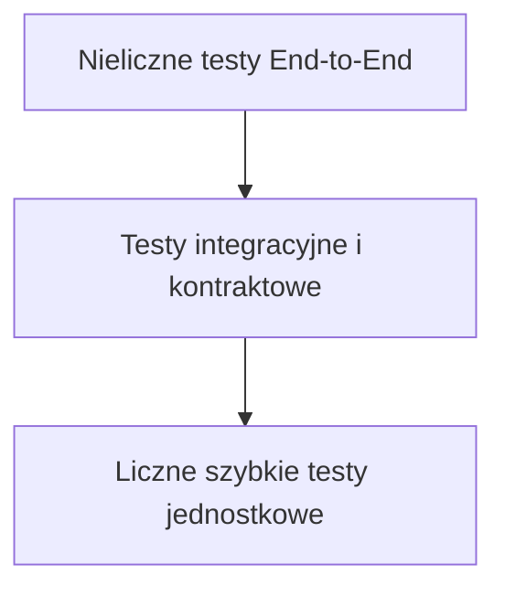

# 05. Strategia testowania

> Strategia weryfikacji zachowania, kontraktów i granic architektonicznych Athlete Platform.

## Spis treści

- [Cele](#cele)
- [Test Pyramid](#test-pyramid)
- [Unit Tests](#unit-tests)
- [Integration Tests](#integration-tests)
- [Regression Tests](#regression-tests)
- [Architecture Tests](#architecture-tests)
- [Determinism Tests](#determinism-tests)
- [Smoke Tests](#smoke-tests)
- [End-to-End Tests](#end-to-end-tests)
- [Coverage Philosophy](#coverage-philosophy)
- [Dane i izolacja testów](#dane-i-izolacja-testów)
- [CI recommendations](#ci-recommendations)
- [Praktyczne checklisty](#praktyczne-checklisty)
- [Definition of Done](#definition-of-done)
- [Powiązane dokumenty](#powiązane-dokumenty)

## Cele

Testy mają zapewnić, że:

- reguły biznesowe zachowują się zgodnie z kontraktem;
- kanoniczne workflow nie są omijane;
- wynik jest deterministyczny dla tych samych danych;
- adaptery zachowują semantykę modeli i storage;
- publiczne API oraz aktywne entry pointy nie ulegają przypadkowej regresji;
- błąd jest wykrywany możliwie blisko warstwy, która jest jego właścicielem.

Test nie powinien utrwalać prywatnych szczegółów implementacji, chyba że ten szczegół stanowi wymagany niezmiennik architektoniczny, np. „każda reguła jest uruchamiana dokładnie raz”.

## Test Pyramid



Podstawa piramidy to szybkie, izolowane testy reguł, builders i engines. Testy integracyjne obejmują repozytoria, parsowanie, composition i granice workflow. Nieliczne E2E potwierdzają działanie najważniejszych ścieżek bez zastępowania nimi testów niższego poziomu.

## Unit Tests

Test jednostkowy obejmuje jednego właściciela zachowania i nie wymaga rzeczywistej bazy ani pliku.

Wymagane wzorce:

- jedna reguła Recommendation: brak aktywacji, aktywacja i przypadki graniczne;
- `RecommendationBuilder`: deduplikacja, priorytet, confidence, evidence, source rules, czas, ID i kolejność;
- `RecommendationEngine`: wywołanie reguł i delegowanie bez testowania ich logiki;
- Observation/Insight rules: fakty wejściowe, confidence, evidence i `as_of`;
- Decision: diagnoza, preskrypcja, selection i strukturalne reasons;
- Recovery i Performance calculations: progi oraz wartości graniczne;
- Planner: selection context, recipe i kompilacja DSL;
- Presenter: mapowanie gotowego wyniku bez uruchamiania silników.

Preferuj jawne fakes i spies nad rozbudowanym mockowaniem prywatnych metod. Test powinien odróżniać równość wartości od tożsamości obiektu wtedy, gdy kontrakt wymaga przekazania dokładnie tego samego contextu lub snapshotu.

## Integration Tests

Test integracyjny sprawdza współpracę co najmniej dwóch realnych komponentów albo komponent z rzeczywistą granicą infrastruktury.

Obszary wymagające integracji:

- `AthleteMemoryRepository` + DuckDB schema;
- writer → event → reader → snapshot;
- parser FIT → `ParsedActivity` → `Activity`;
- `PostWorkoutRecordingService` → pipeline → Memory writer;
- `IntelligenceDecisionWorkflow` z realnymi builders i engines;
- composition factories i ich graf zależności;
- MorningCoachUseCase z kontrolowanymi adapterami danych;
- publiczne eksporty pakietów.

Testy storage powinny używać izolowanej, tymczasowej bazy. Nie mogą modyfikować `data/database/health.duckdb`.

## Regression Tests

Test regresyjny dodaj zawsze, gdy:

- błąd dotknął zachowania użytkownika lub publicznego API;
- poprawka dotyczy granicy między warstwami;
- przypadek przeszedł wcześniej przez testy, ale zawiódł w pełnym pipeline;
- zmiana naprawia niedeterministyczność, kolejność, deduplikację lub identity;
- migracja usuwa alternatywną ścieżkę;
- błąd wynikał z ręcznego stringa zamiast wartości enuma;
- adapter błędnie zinterpretował wyjątek infrastruktury;
- import lub CLI przestał działać przez cykl zależności.

Test powinien najpierw odtwarzać dokładny warunek błędu, a dopiero potem potwierdzać poprawkę. Nie zastępuj go ogólnym testem „nie rzuca wyjątku”.

## Architecture Tests

Testy architektoniczne chronią odpowiedzialności, których zwykły test wyniku może nie wykryć.

Przykłady obowiązujących asercji:

- `MorningCoachUseCase` nie importuje ani nie przyjmuje `DecisionEngine`, `RecommendationEngine` i legacy `ExplanationBuilder`;
- `IntelligenceDecisionWorkflow` wywołuje Recommendation Engine dokładnie raz;
- Recommendation Engine nie analizuje pól contextu i przekazuje wszystkich kandydatów builderowi;
- Recommendation Builder nie uruchamia reguł;
- Planner otrzymuje `DecisionResult`, nie `RecommendationResult`;
- composition root tworzy świeże instancje i dokładnie sześć aktualnych Recommendation Rules;
- CLI korzysta z `build_morning_coach_use_case()`;
- reguły i domena nie importują repository, DuckDB ani presentation;
- publiczne symbole można zaimportować w świeżym procesie bez cyklicznego importu.
- Adaptive Goals używa dokładnie jednego readera, jednego trend-quality evaluation i jednego Goal Assessment na datowany przebieg, zachowując identity assessmentu w contextach i wynikach;
- `MorningCoachUseCase` uruchamia `DashboardEngine` dokładnie raz po Presenterze, przekazuje te same obiekty kanoniczne i nie wykonuje dodatkowego odczytu danych;
- Dashboard pozostaje poza Presenterem, `MorningCoachReport`, `DecisionResult` i `RecommendationContext`;
- serializer Dashboardu ma dokładne snapshoty kluczy i wartości, strict error tests oraz round-trip dla naive i aware timestamps;
- clean-checkout test potwierdza import `dashboard` i `application`, pełny pytest oraz serialize/deserialize bez korzystania z lokalnych artefaktów;

Takie testy mogą używać spies, introspekcji sygnatur, analizy importów lub minimalnego smoke procesu. Nie powinny zakładać nazw prywatnych pól, jeżeli kontrakt nie zależy od nich.

## Determinism Tests

Dla reprezentatywnego wejścia wykonaj komponent co najmniej dwa razy i porównaj kompletny wynik.

Sprawdzaj:

- observations i insights;
- decision oraz plan;
- rekomendacje, kolejność i ID;
- explainability;
- finalny report;
- typowany `AthleteDashboard`, łącznie z wersją, datami, statusami sekcji i kolejnością rekomendacji;
- prymitywny payload Dashboardu, zachowanie `None`, kolejności list i pełny round-trip bez mutacji;
- wynik dla odwróconej kolejności kandydatów lub reguł, jeśli kolejność nie należy do kontraktu;
- brak mutacji inputu;
- brak stanu pozostającego między wywołaniami.

Test musi używać stałych timestampów. Samo zamrożenie zegara nie usprawiedliwia użycia zegara systemowego w domenie.

## Smoke Tests

Smoke test daje szybką odpowiedź, czy aplikacja może się uruchomić:

- import publicznych symboli z `application` i `recommendation` w świeżym procesie;
- zbudowanie factories composition root bez odczytu produkcyjnej bazy;
- `python3 -m compileall -q` dla kodu projektu;
- bezpieczny test entry pointu CLI;
- kompilacja i parsowanie reprezentatywnego workout DSL;
- import kontrolowanego, testowego FIT bez zapisu do danych produkcyjnych.

Jeżeli CLI nie ma bezpiecznego `--help`, użyj istniejącego testu CLI zamiast uruchamiać operację na realnej bazie.

## End-to-End Tests

E2E obejmuje pełną ścieżkę z kontrolowanych wejść do raportu lub zapisanego eventu.

Minimalne scenariusze MorningCoach:

| Scenariusz | Oczekiwany zakres |
|---|---|
| Neutralny dzień | canonical decision, kontrolowany pusty RecommendationResult, poprawny report |
| Niska regeneracja | redukcja zgodna z Decision Engine, recovery recommendation, canonical explainability |
| Dług snu | `EXTEND_SLEEP` i odpowiadający tekst explainability |
| Zwiększona potrzeba regeneracji | hydration/mobility według obecnych reguł, stabilne evidence i ID |
| Wiele reguł | deterministyczna kolejność i brak duplikatów typu |
| Brak danych | kontrolowany wynik zgodny z publicznym kontraktem |
| Dashboard z kompletem danych | assembler otrzymuje te same instancje źródłowe, a sekcje zachowują statusy i deterministyczną kolejność |
| Dashboard z brakującymi źródłami | `UNAVAILABLE` jest odróżnione od dostępnego, lecz pustego wyniku rekomendacji |

Nie istnieje obecnie osobny sygnał domenowy odwodnienia. Test `INCREASE_HYDRATION` powinien używać aktualnych triggerów reguły, a nie udawać nieistniejącego pomiaru hydration.

Minimalny scenariusz post-workout:

```text
test FIT + explicit Workout
→ Activity
→ PostWorkoutPipeline
→ WORKOUT_COMPLETED
→ AthleteMemorySnapshot
```

Powtórny import tej samej Source Identity powinien mieć kontrolowane zachowanie duplicate.

## Coverage Philosophy

Coverage jest wskaźnikiem luk, nie celem samym w sobie.

Priorytety pokrycia:

1. decyzje, reguły oraz progi biznesowe;
2. kontrakty publiczne i migracje;
3. identity, daty, jednostki i deduplikacja;
4. workflow oraz granice odpowiedzialności;
5. adaptery storage i formatów zewnętrznych;
6. obsługa błędów i brak danych.

100% line coverage nie gwarantuje poprawności architektury. Nie dodawaj bezwartościowych asercji tylko po to, aby podnieść procent. Każdy krytyczny invariant powinien jednak mieć test, nawet jeśli linia jest już wykonana przez inny scenariusz.

**TODO:** Repozytorium nie definiuje obecnie obowiązkowego progu procentowego coverage.

## Dane i izolacja testów

- Używaj stałych dat i jawnych fixtures.
- Buduj minimalne modele potrzebne do scenariusza.
- Nie zależ od kolejności wykonania testów.
- Nie korzystaj z sieci ani rzeczywistych zewnętrznych kont użytkownika.
- Nie zapisuj do produkcyjnej bazy w repozytorium.
- Każdy test bazy otrzymuje własny cykl życia zasobu.
- Nie współdziel mutowalnego stanu między testami.
- Dla inputów plikowych korzystaj z małych, wersjonowanych fixtures w `tests/`.

## CI recommendations

Repozytorium nie zawiera obecnie skonfigurowanego workflow CI. Poniższa sekcja jest rekomendacją, a nie opisem istniejącej automatyzacji.

### Pull request

1. `python3 -m compileall -q` dla kodu projektu;
2. `python3 -m pytest -q`;
3. test publicznych importów w świeżym procesie;
4. `git diff --check`;
5. opcjonalny raport coverage bez blokującego progu do czasu przyjęcia polityki;
6. kontrola, czy zmiana schematu, publicznego API lub granicy ma ADR/migrację.

### Main branch

- pełny pytest;
- izolowane smoke/E2E dla kanonicznego MorningCoach i post-workout;
- publikacja raportu czasu najwolniejszych testów;
- brak dostępu do produkcyjnych danych i sekretów w testach.

**TODO:** Wybrać platformę CI, wspierane wersje Pythona poza minimum `>=3.9` oraz formalną politykę coverage.

## Praktyczne checklisty

### Nowa reguła domenowa

- [ ] test braku aktywacji;
- [ ] test aktywacji;
- [ ] test wartości granicznych;
- [ ] test evidence, confidence i czasu;
- [ ] wynik immutable i bez mutacji inputu;
- [ ] dwa wykonania dają ten sam wynik;
- [ ] brak repository, zegara i I/O.

### Nowy workflow lub use case

- [ ] wszystkie zależności są w konstruktorze;
- [ ] każda zależność jest wywołana oczekiwaną liczbę razy;
- [ ] dokładnie te same obiekty są przekazywane między etapami, gdy wymaga tego kontrakt;
- [ ] brak logiki domenowej w orkiestracji;
- [ ] happy path, pusty input i błąd zależności są pokryte;
- [ ] composition factory ma test;
- [ ] nie powstał alternatywny pipeline.

### Zmiana repository lub eventu

- [ ] test schema/serializacji;
- [ ] test odczytu i round-trip;
- [ ] test duplicate identity;
- [ ] test niepowiązanego constraint error;
- [ ] zachowana semantyka append-only;
- [ ] wersja schema i zgodność readera sprawdzone;
- [ ] produkcyjna baza nie jest fixture testową.

### Web Product Layer & Transport Boundary (`web/AthleteWeb`)

- **Frontend Unit Tests (Vitest + jsdom)**:
  - testy portu `DashboardPayloadSource` oraz adapterów `StaticJsonDashboardPayloadSource` i `HttpDashboardPayloadSource`;
  - testy ścisłego walidatora `parseAthleteDashboardPayloadV1`;
  - testy mapperów prezentacyjnych dla wszystkich widoków (Morning Briefing, Recovery, Training, Progress, Nutrition, Body Composition);
  - testy obsługi sześciu stanów prezentacyjnych (`ready`, `partial`, `unavailable`, `stale`, `loading`, `failure`);
  - testy braku wycieku danych podglądu (`Preview Data`) do trybów `live-file` i `http`.

- **Backend Endpoint Tests (pytest)**:
  - testy akceptacyjne WSGI serwera `GET /api/v1/dashboard`;
  - testy nagłówka `Content-Type: application/json` i wersji kontraktu `1.0`;
  - testy kontrolowanej obsługi błędów `500` bez wycieku śladu stosu.

### Przed merge

- [ ] testy zmienionego modułu;
- [ ] pełny pytest dla zmiany przekrojowej;
- [ ] compileall;
- [ ] import smoke przy zmianie eksportów;
- [ ] diff check;
- [ ] review architektoniczne według [checklisty](06-review-checklist.md).

## Definition of Done

Zmiana jest przetestowana, gdy:

- [ ] poziom testu odpowiada właścicielowi zachowania;
- [ ] przypadki pozytywne, negatywne i graniczne są pokryte;
- [ ] każda naprawiona regresja ma reprodukujący test;
- [ ] deterministyczne komponenty mają test powtarzalności i braku mutacji;
- [ ] integracja z I/O używa izolowanych danych;
- [ ] publiczne importy i aktywne entry pointy działają;
- [ ] pełny zestaw testów przechodzi, jeżeli zmiana dotyka wspólnego workflow;
- [ ] wynik weryfikacji został zaraportowany bez ukrywania skipped lub failed.

## Powiązane dokumenty

- Poprzedni: [Standardy kodowania](04-coding-standards.md)
- Indeks: [Engineering Handbook](README.md)
- Następny: [Lista kontrolna review](06-review-checklist.md)
- [Architektura](02-architecture.md)
- [Prompty Codex](prompts/codex.md)
